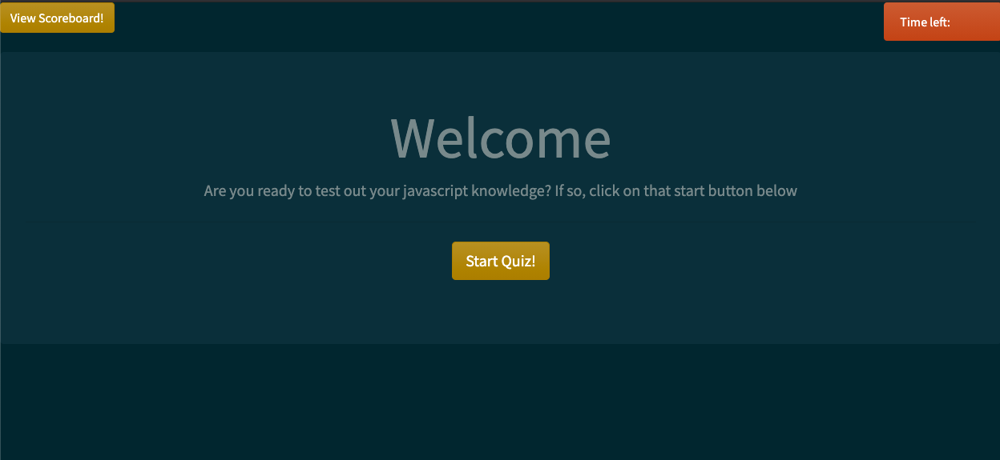

# Description
The following is a simple quiz web app. It contains a set of questions that the user can answer. They have a set amount of time to answer the questions and if they answer a question wrong, then this deducts time. If they run out of time before answering all the questions, then they automaticall get a score of 0. If they answer all questions before the allotted time is over then they are presented with their score and are asked to add in their name. This then adds them to the score board! 

# Technologies and Packages used
    1. [Bootstrap](https://getbootstrap.com/docs/4.0/components/jumbotron/)

# Javascript Concepts Used
    1. Javascript web api's 
    2. SetInterval()
    3. Event Handlers
    4. Event Bubbling
    5. Event Delegation
    6. Use of local storage in browser
    7. Functional programming

# Link to Deployed project and screenshot.

[Link to deployed site](https://v-lax.github.io/CodingQuizWebbApp/)

